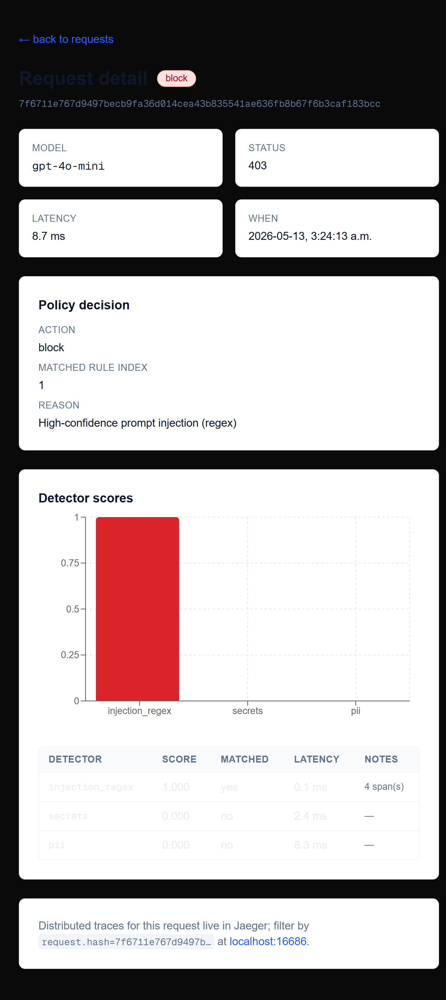

# promptwall

> A self-hosted LLM safety gateway. Drop it in front of any OpenAI-compatible provider with a one-line client change.

[](https://github.com/MoeezW/promptwall/actions/workflows/ci.yml)
[](./LICENSE)
[](https://www.python.org/)

promptwall sits between your application and an LLM provider as a drop-in OpenAI-compatible proxy. Every request and response is scanned against a YAML-driven policy — prompt injection, PII, secrets — with detectors running concurrently under per-detector latency budgets and circuit breakers, so a single slow model never drags the request path. Detected PII is replaced with reversible HMAC-keyed tokens before forwarding and re-hydrated on the way back, preserving completion quality end-to-end. Every decision is logged with an OpenTelemetry trace and every release is benchmarked against public corpora with 95% bootstrap confidence intervals.



## Headline numbers

Reproduced with `make bench-with-ml` at seed 42; full table in [`benchmarks/results.md`](./packages/core/benchmarks/results.md).

| Corpus | Detection rate | 95% CI | False-positive rate | 95% CI |
|---|---|---|---|---|
| `Lakera/gandalf_ignore_instructions` (n=500) | **100%** | [100%, 100%] | — | — |
| `OpenAssistant/oasst1` benign baseline (n=500) | — | — | **1.0%** | [0.2%, 2.0%] |
| ML detector latency on 256-token prompts | — | — | p99 **~33ms** | — |

The detector is `protectai/deberta-v3-base-prompt-injection-v2` exported to ONNX and run via ONNX Runtime — no torch at runtime, image stays under 1 GB. See [ADR-0004](./docs/adrs/0004-onnx-runtime-over-torch.md).

## Three-line integration

```python
from openai import OpenAI

client = OpenAI(base_url="http://localhost:8000/v1")  # ← only change

resp = client.chat.completions.create(
    model="gpt-4o-mini",
    messages=[{"role": "user", "content": "..."}],
)
```

That's it. The proxy speaks the OpenAI chat-completions shape, runs the configured detectors, applies the policy, forwards to the real provider on `allow` or `redact`, and short-circuits to a `403` on `block`. Streaming is forwarded as SSE pass-through (not scanned in v0.1 — see [Limitations](#limitations)).

## Architecture

```
client ──HTTP──► proxy ──► detectors (TaskGroup) ──► policy ──► provider
                   │                │                  │
                   │            circuit                redact
                   │            breakers               (HMAC-keyed tokens)
                   │
                   └──► Postgres (request + decision)
                   └──► OTLP traces (Jaeger)
                   └──► /api/* read API ◄── Next.js dashboard
```

Sequence diagrams for the happy / blocked / redacted paths live in [`docs/ARCHITECTURE.md`](./docs/ARCHITECTURE.md).

## What's in the box

- **OpenAI-compatible proxy** at `POST /v1/chat/completions`. SSE streaming pass-through for `stream=true`.
- **Detectors:**
  - `injection_regex` — curated pack of ~30 prompt-injection patterns drawn from public corpora.
  - `injection_ml` — `protectai/deberta-v3-base-prompt-injection-v2` via ONNX Runtime, ~18 ms p99 FP32.
  - `pii` — Microsoft Presidio with a Luhn-validated Canadian SIN recognizer on top of the default recognizers.
  - `secrets` — thin wrapper around Yelp's `detect-secrets`.
- **Structured concurrency** — `asyncio.TaskGroup` runs detectors in parallel, each with its own timeout and circuit breaker ([ADR-0003](./docs/adrs/0003-structured-concurrency-with-circuit-breakers.md)).
- **Reversible PII redaction** — HMAC-SHA256 tokens with a per-request 32-byte salt; round-trip property test (`hydrate(redact(text)) == text`) defends the invariant ([ADR-0002](./docs/adrs/0002-reversible-pii-redaction.md)).
- **YAML policy engine** — Pydantic-validated schema, `simpleeval` expression evaluator over detector results, configurable `degraded_action` for shed detectors.
- **Reproducible benchmarks** — `make bench` over `Lakera/gandalf_ignore_instructions`, JailbreakBench, and `OpenAssistant/oasst1`; 10,000-resample percentile bootstrap CIs at seed 42.
- **Dashboard** — Next.js 16 App Router. Request list with action badges; request-detail page with the per-detector score chart, decision tree, and a deep link to the Jaeger trace.
- **Observability** — structured JSON logs (structlog) and one OTel span tree per request (`proxy.chat.completions` → `detectors.scan`, `provider.openai.forward`).

## Why this exists

Production LLM applications need an enforcement point that isn't the application itself. Doing safety checks in-process means every team reimplements them, every deploy can regress them, and the audit trail lives in whatever log format the dev felt like. A reverse proxy externalizes the policy, gives operators a single place to tune it, and produces a decision log that's the same shape no matter which application made the call.

The three things that distinguish promptwall from a weekend `if "ignore" in prompt: deny()` script:

1. **Concurrent detectors with bounded latency.** Most portfolio firewalls run detectors sequentially under a single global timeout. A slow detector poisons every request. `TaskGroup` + per-detector timeouts + per-detector circuit breakers means a hung detector trips a breaker and gets shed instead of dragging the request path down.
2. **Reversible redaction.** Replacing a credit card with `[REDACTED]` destroys completion quality. Replacing it with `<PII:CREDIT_CARD_a1b2c3d4>` and re-hydrating on the response preserves the model's reasoning over typed slots, and the per-request salt prevents cross-request token linkability.
3. **Numbers with confidence intervals.** Every detection-rate claim is paired with a 95% bootstrap CI at a fixed seed against a named public corpus. Single point estimates are unfalsifiable; CIs are the language of grown-up evaluation.

## Limitations

Honest list, not roadmap copy:

- **Streaming responses are not scanned.** `stream=true` requests pass through as SSE without inspection. Output-side scanning of streamed tokens is a Phase-2 feature — the read API and the dashboard already render the request-side decision, but the response body in those rows is left empty.
- **The ML detector's training distribution matters.** The detector achieves 100% on `Lakera/gandalf_ignore_instructions` (a corpus aligned with its training distribution) but only ~46% on `deepset/prompt-injections` (which mixes in roleplay framing and urgency tactics the base model wasn't trained for). Both numbers are in [`benchmarks/results.md`](./packages/core/benchmarks/results.md); they reflect the real shape of the detector, not a marketing average.
- **JailbreakBench harmful behaviors are not "injection."** They are direct harmful-content requests. An injection detector legitimately scores near 0% on them; this is a *content-policy* problem, not a *prompt-injection* problem, and we don't shade the numbers.
- **No authentication on the proxy.** v0.1 is run behind a trusted edge (API gateway, mesh, your reverse proxy of choice). Per-key auth and rate limiting are on the roadmap.
- **Single Postgres instance, in-process circuit breakers.** Breaker state is per-process by design; a multi-instance deployment has per-pod breakers. This is correct for the failure mode (a detector is broken on *this* process), not a limitation in disguise.

## Development

```bash
make dev          # postgres + jaeger via docker compose
make migrate      # alembic upgrade head
make serve        # uvicorn on :8000 (proxy + read API)
make dashboard    # next.js dev server on :3000 (proxies /api/* to :8000)
make test         # full test suite, 80% coverage gate
make lint         # ruff check + format
make typecheck    # mypy --strict
make bench        # benchmark harness, n=1000
make bench-smoke  # benchmark harness, n=100 (for CI / quick iteration)
make bench-with-ml  # bench with the ML detector enabled
```

The full stack (postgres + jaeger + core + dashboard) runs from a clean clone via:

```bash
docker compose --profile full up --build
```

Environment variables are documented in [`.env.example`](./.env.example).

## Roadmap

In rough order of priority:

1. **Streamed output scanning.** Detector pipeline over SSE chunks with a small accumulation window.
2. **Anthropic provider adapter.** Same `ProviderAdapter` ABC, second concrete implementation.
3. **Encrypted at-rest mapping for redaction.** Today the mapping is in-memory per request; persisting it under `cryptography.fernet` enables audit-replay of redacted responses.

## Acknowledgments

- [Microsoft Presidio](https://github.com/microsoft/presidio) for the PII recognizer engine.
- [ProtectAI](https://huggingface.co/protectai) for `deberta-v3-base-prompt-injection-v2`.
- [Yelp's `detect-secrets`](https://github.com/Yelp/detect-secrets) for the credential scanner.
- [Lakera](https://huggingface.co/datasets/Lakera/gandalf_ignore_instructions), [JailbreakBench](https://github.com/JailbreakBench/jailbreakbench), and [OpenAssistant](https://huggingface.co/datasets/OpenAssistant/oasst1) for the public corpora.

## License

[Apache-2.0](./LICENSE).
