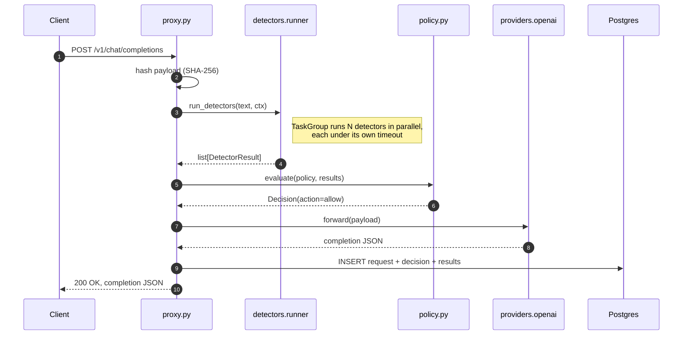
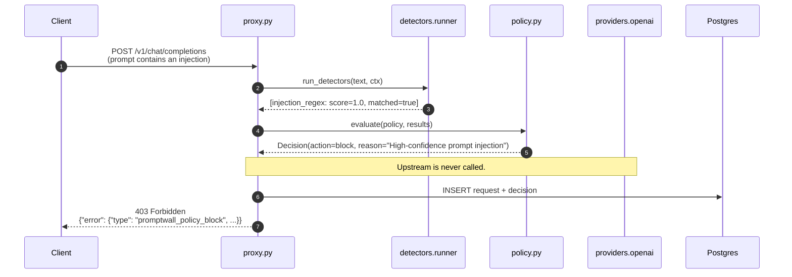
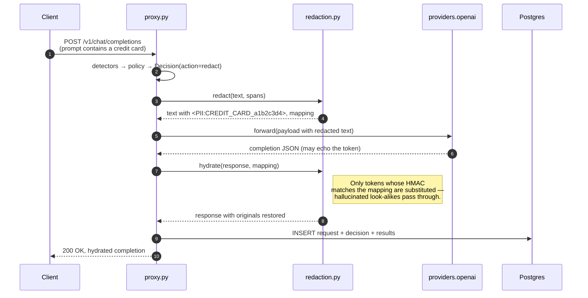

# Architecture

This document covers the request lifecycle, the data model, and the rationale behind the structured-concurrency detector runner. For decision rationale on individual components see the ADRs in [`docs/adrs/`](./adrs/).

## Components

```
                ┌────────────────────────────────────────────────────┐
                │                       promptwall                   │
                │                                                    │
client ──HTTP──►│  proxy.py  ──► detectors.runner  ──► policy.py     │
                │     │                │                    │        │
                │     │            circuit.py             config.py  │
                │     │                                              │
                │     ├──► redaction.py (HMAC tokens)                │
                │     │                                              │
                │     └──► providers.openai ──HTTP──► api.openai.com │
                │                                                    │
                │  api.py (read-only) ◄── dashboard at :3000         │
                │                                                    │
                │  models.py (SQLModel) ──► Postgres 16              │
                │  telemetry.py        ──► OTLP ──► Jaeger           │
                └────────────────────────────────────────────────────┘
```

The proxy and the dashboard read API are mounted on the same FastAPI app, so a single uvicorn process serves both `POST /v1/chat/completions` and `GET /api/requests`. The Next.js dashboard hits the read API via Next's `rewrites` to avoid CORS in dev.

## The request lifecycle

### Happy path (allow)



### Blocked path (injection detected)



### Redacted path (PII detected)



## The detector runner

The orchestration in `detectors/runner.py` is the operational-maturity signal:

- **`asyncio.TaskGroup`** runs the enabled detectors in parallel. A child task that raises is contained by the structured-concurrency boundary; a child that times out is converted to a synthetic `DetectorResult` rather than propagating.
- **Per-detector timeout**, sourced from the policy's `detectors.{name}.timeout_ms`. The runner wraps each `Detector.scan` call in `asyncio.timeout(...)`. Timeouts and exceptions both trip the circuit breaker for that detector.
- **Per-detector circuit breaker** (`detectors/circuit.py`) is a three-state FSM with configurable failure threshold and recovery window. When open, the runner skips the detector entirely and emits a synthetic degraded result. The policy engine sees `<detector>: degraded` and falls through to the rule's `degraded_action` (default `block`).

Total per-request scan latency is bounded by `max(detector_timeouts)`, not the sum — see [ADR 0003](./adrs/0003-structured-concurrency-with-circuit-breakers.md) for the why and `tests/property/` for the property tests that defend the invariants.

## Data model

One table, kept narrow on purpose ([`models.py`](../packages/core/src/promptwall/models.py)):

| Column | Type | Notes |
|---|---|---|
| `id` | UUID | Primary key. |
| `request_hash` | varchar(64) | SHA-256 of the canonical JSON payload. Indexed. |
| `model` | varchar(128) | The `model` field from the request. |
| `latency_ms` | float | Wall-clock from receipt to response. |
| `status` | int | HTTP status returned to the client. |
| `detector_results` | jsonb | Array of `DetectorResult` snapshots. |
| `policy_decision` | jsonb | `{action, reason, matched_rule_index, degraded_detectors}`. |
| `created_at` | timestamptz | Default `now()`. |

Request and response *bodies* are not logged in v0.1. The hash is enough to identify a request without storing potentially-sensitive content; toggling content capture behind a config flag is on the roadmap.

## Observability

Every request gets one OTel span tree:

- `proxy.chat.completions` (root)
  - `detectors.scan`
  - `provider.openai.forward` (only present on allow/redact paths)

Spans carry `model`, `request.hash`, `policy.action`, `policy.matched_rule`, `http.status_code`, and `latency_ms` as attributes. The OTLP exporter ships them to the Jaeger instance brought up by `make dev`; the dashboard's request-detail page deep-links to the corresponding trace in the Jaeger UI.

Logs are structured JSON via structlog. Every line carries `event=...` and `request_id` (the request hash prefix) where applicable. The log renderer is configurable to `console` for human-readable dev output.
